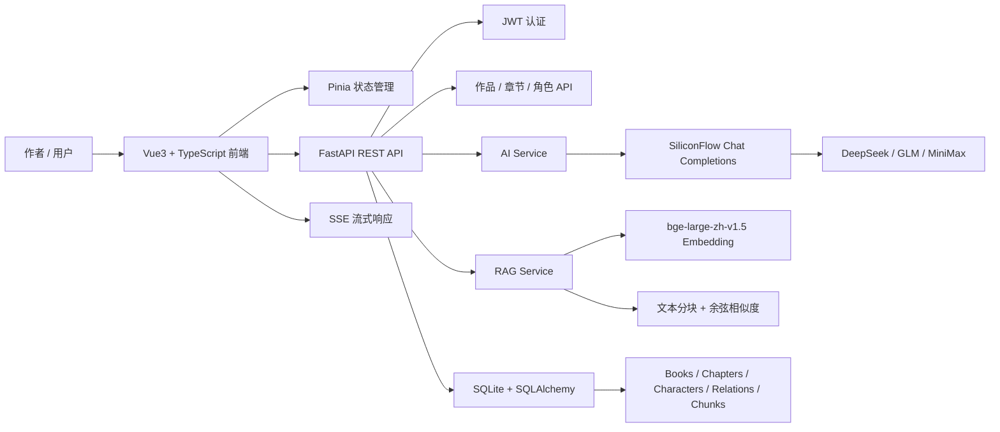
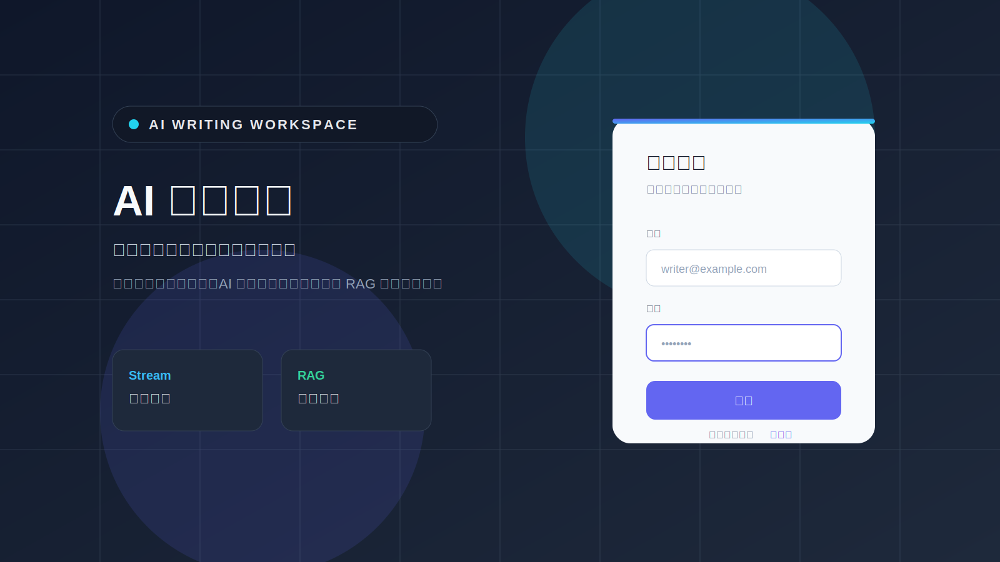
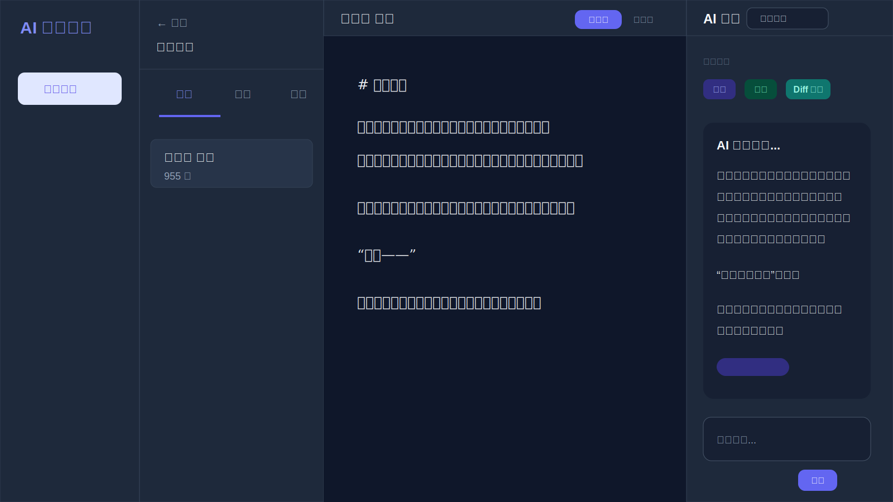
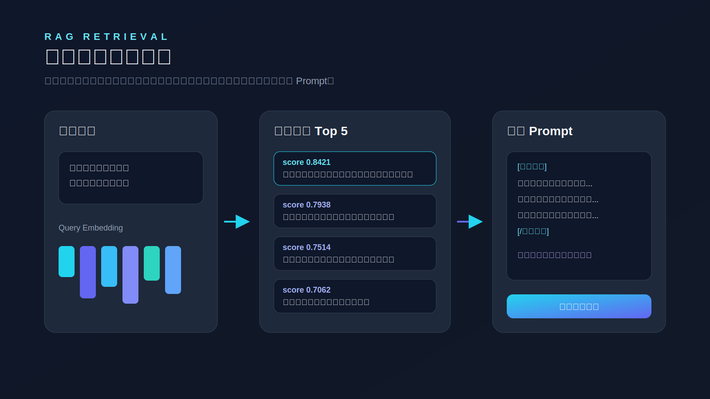
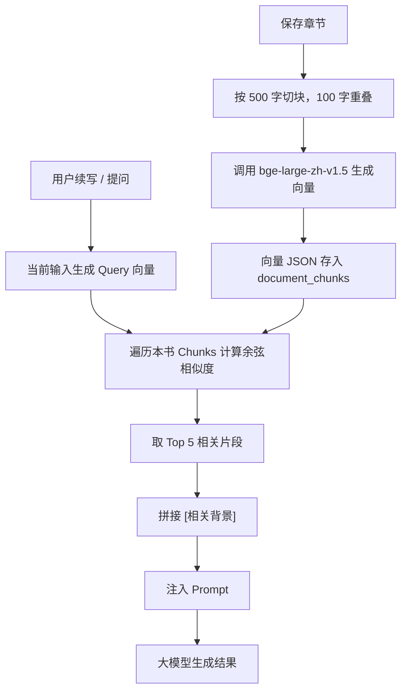

# AI Copilot 写作平台

面向长篇小说创作的 AI 全栈写作辅助系统。项目基于 **FastAPI + Vue3 + TypeScript** 构建，集成多模型写作、SSE 流式生成、RAG 检索增强、AI Diff 润色、人物识别和角色关系图谱，目标是把传统“AI 聊天框”升级成一个可落地的小说创作工作台。

项目已支持一键初始化示例作品，便于本地体验和面试演示。

## 在线体验

| 服务 | 地址 |
|------|------|
| 前端体验 | https://ai-writing-assistant-web.onrender.com |
| 后端健康检查 | https://ai-writing-assistant-api-o4nb.onrender.com/api/health |

> Render 免费实例在长时间无人访问后会自动休眠，首次打开可能需要等待几十秒唤醒。

---

## 技术栈

| 模块 | 技术 |
|------|------|
| 前端 | Vue3、TypeScript、Pinia、Vue Router、Tailwind CSS、Vite |
| 后端 | FastAPI、SQLAlchemy 2.0、Pydantic、SQLite、httpx |
| AI 能力 | SiliconFlow Chat Completions、DeepSeek、GLM、MiniMax、SSE |
| RAG | bge-large-zh-v1.5、文本分块、Embedding、余弦相似度检索 |
| 认证 | JWT Token、bcrypt 密码加密 |
| 工程化 | Docker Compose、pytest、环境变量配置 |

---

## 核心功能

| 功能 | 说明 |
|------|------|
| 作品工作台 | 管理作品、章节、大纲、角色、灵感和写作统计 |
| AI 续写 | 根据当前章节和 RAG 背景自然延续故事 |
| AI 润色 / 校对 / 摘要 | 优化表达、修正问题、总结章节内容 |
| 流式生成 | 使用 SSE 实现 AI 内容逐字输出 |
| AI Diff 润色 | 后端计算原文与润色文本差异，前端展示可控修改 |
| 人物识别 | 从章节正文中抽取人物候选，确认后保存到角色库 |
| 角色关系图 | 可视化展示人物关系、阵营和剧情冲突 |
| RAG 检索增强 | 保存章节时建立向量索引，续写时召回相关上下文 |
| 多模型切换 | 支持 DeepSeek、GLM、MiniMax 等模型 |
| 示例作品初始化 | 一键生成章节、人物、关系、大纲和灵感数据 |

---

## 系统架构图



---

## 页面截图

### 登录页



### 工作台首页


### 最近作品与人物关系概览


### 写作编辑器


### AI 续写流式生成



### 角色关系图


### RAG 检索效果



---

## RAG 实现流程



实现要点：

- `split_into_chunks`：将长章节切成固定窗口，并保留重叠文本，避免关键信息被切断。
- `embed_text`：调用 SiliconFlow Embedding API，把文本转成语义向量。
- `search_similar`：对 query 与历史片段向量计算余弦相似度，返回最相关片段。
- `build_rag_context`：将召回内容包装为 `[相关背景]...[/相关背景]`，注入续写 Prompt。
- 向量化失败不会阻塞章节保存，保证编辑器的核心写作流程稳定。

---

## 多模型接入说明

后端通过统一的 `call_siliconflow` 方法调用 Chat Completions，前端只需要传入模型 ID 即可切换模型。

当前可选模型配置位于 `backend/app/config.py`：

| 展示名 | 模型 ID |
|--------|---------|
| DeepSeek-V4-Flash | `deepseek-ai/DeepSeek-V4-Flash` |
| DeepSeek-V3.2 | `deepseek-ai/DeepSeek-V3.2` |
| GLM-4.7 | `zai-org/GLM-4.7` |
| GLM-Z1-32B | `THUDM/GLM-Z1-32B-0414` |
| MiniMax-M2.5 | `MiniMaxAI/MiniMax-M2.5` |

模型切换逻辑：

1. 前端 AI 面板选择模型。
2. 请求中携带 `model` 字段。
3. 后端优先使用请求模型，否则使用 `.env` 中的 `DEEPSEEK_MODEL`。
4. 流式接口和非流式接口共用同一套模型调用逻辑。

---

## 本地启动方式

### 1. 启动后端

```bash
cd backend
python -m venv venv
source venv/bin/activate
pip install -r requirements.txt
uvicorn app.main:app --reload --host 0.0.0.0 --port 8000
```

### 2. 启动前端

```bash
cd frontend
npm install
npm run dev
```

### 3. 访问地址

| 服务 | 地址 |
|------|------|
| 前端 | http://localhost:5173 |
| 后端 | http://localhost:8000 |
| API 文档 | http://localhost:8000/docs |

---

## Docker Compose 启动方式

```bash
cp .env.docker.example .env
docker-compose up --build
```

访问地址：

| 服务 | 地址 |
|------|------|
| 前端 | http://localhost |
| 后端 | http://localhost:8000 |
| API 文档 | http://localhost:8000/docs |

停止服务：

```bash
docker-compose down
```

---

## Render 在线部署

项目已提供 `render.yaml`，可以通过 Render Blueprint 从 GitHub 一键创建两个线上服务：

| 服务 | 类型 | 说明 |
|------|------|------|
| `ai-writing-assistant-api` | Web Service | FastAPI 后端，使用 Docker 部署 |
| `ai-writing-assistant-web` | Static Site | Vue3 前端，构建后托管静态资源 |

部署时需要配置：

- 后端环境变量 `SILICONFLOW_API_KEY`
- 前端环境变量 `VITE_API_URL`，值为后端地址加 `/api`

示例：

```env
VITE_API_URL=https://ai-writing-assistant-api-o4nb.onrender.com/api
```

Render 负责构建、托管和提供公网访问地址，适合把项目快速部署成可在线体验的作品集 Demo。

---

## 环境变量说明

本地开发可在 `backend/.env` 配置，Docker 部署可复制 `.env.docker.example` 到根目录 `.env`。

```env
SECRET_KEY=your-secret-key
SILICONFLOW_API_KEY=your-api-key
SILICONFLOW_BASE_URL=https://api.siliconflow.cn/v1
DEEPSEEK_MODEL=deepseek-ai/DeepSeek-V3.2
DATABASE_URL=sqlite+aiosqlite:///./writing_platform.db
ACCESS_TOKEN_EXPIRE_MINUTES=1440
```

| 变量 | 是否必填 | 说明 |
|------|----------|------|
| `SECRET_KEY` | 是 | JWT 加密密钥 |
| `SILICONFLOW_API_KEY` | 是 | 大模型和 Embedding 调用密钥 |
| `SILICONFLOW_BASE_URL` | 否 | SiliconFlow API 地址 |
| `DEEPSEEK_MODEL` | 否 | 默认聊天 / 写作模型 |
| `DATABASE_URL` | 否 | SQLAlchemy 数据库连接 |
| `ACCESS_TOKEN_EXPIRE_MINUTES` | 否 | 登录 Token 过期时间 |

---

## 项目亮点

- **业务闭环完整**：从登录、作品管理、章节编辑、AI 辅助到人物关系图，形成完整写作工作流。
- **AI 不只是聊天框**：把续写、润色、Diff、人物抽取、RAG 分别落到具体写作场景。
- **长文本一致性处理**：通过 RAG 召回历史章节设定，降低长篇创作中的人物和剧情遗忘。
- **可控的 AI 修改**：Diff 润色先展示差异，用户确认后再写回正文，避免 AI 直接污染内容。
- **数据结构可扩展**：作品、章节、大纲、角色、关系、灵感、向量块均独立建模。
- **演示稳定**：支持一键初始化示例作品，即使没有真实写作数据也能快速展示完整链路。
- **工程化能力**：包含 Docker Compose、环境变量、后端测试和清晰 README。

---

## 后续优化方向

- 接入向量数据库，例如 Chroma、Milvus 或 pgvector，提升大规模文本检索性能。
- 增加 RAG 命中片段的前端可视化，让用户看到 AI 使用了哪些背景。
- 增加角色关系自动推荐，根据章节内容自动生成或更新人物关系。
- 增加全文一致性检查，包括人物称呼、时间线、伏笔回收和设定冲突。
- 引入 TipTap 富文本编辑器，支持批注、章节卡片和导出。
- 支持 TXT、Markdown、EPUB 导出。
- 增加更多端到端测试，覆盖登录、初始化示例作品、AI 面板和关系图切换。

---

## 测试

```bash
cd backend
source venv/bin/activate
pytest tests/ -v
```

已覆盖认证、JWT、AI Prompt、Diff 解析、人物识别 JSON 解析、RAG 文本分块与相似度、作品/章节/角色 API。

---

## 项目信息

- GitHub: https://github.com/tbyang28/ai-writing-assistant
- 在线体验: https://ai-writing-assistant-web.onrender.com
- 后端健康检查: https://ai-writing-assistant-api-o4nb.onrender.com/api/health
- 作者: Tianbo Yang
- 用途: AI 全栈开发实习项目展示
