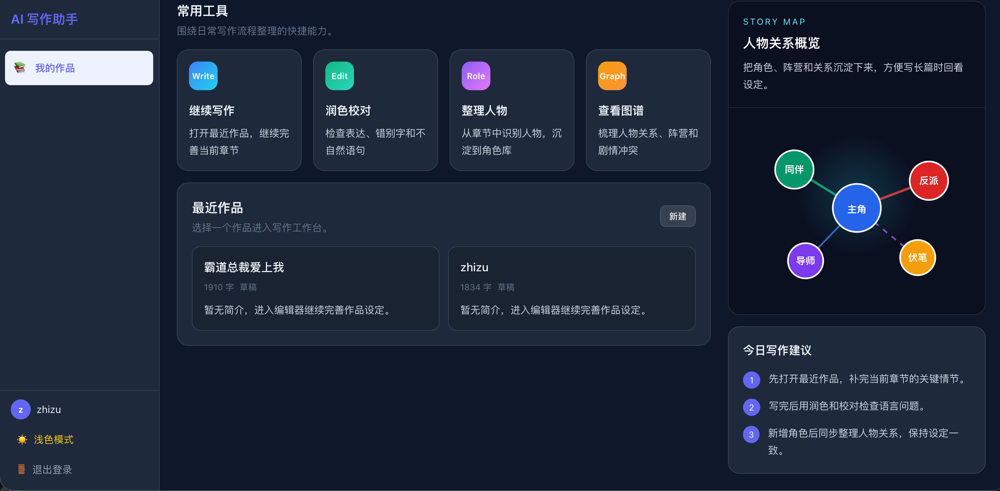
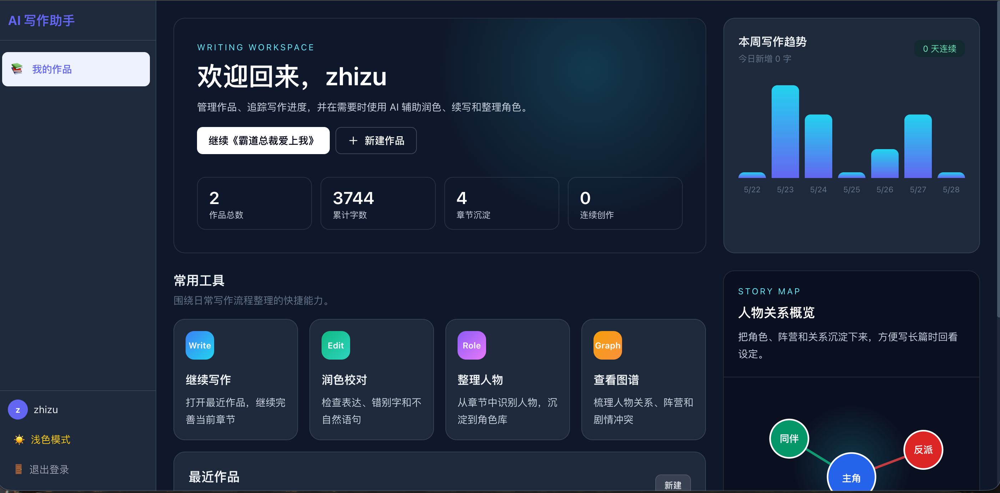
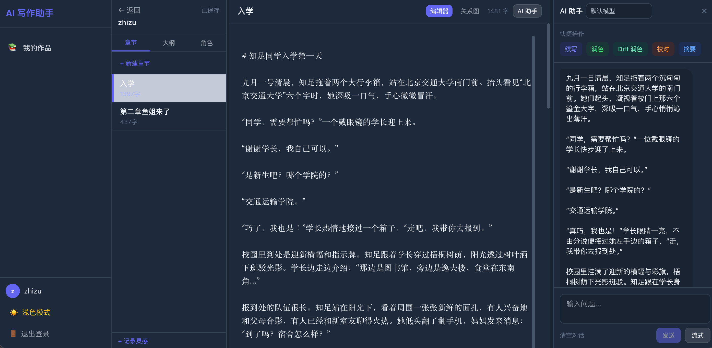
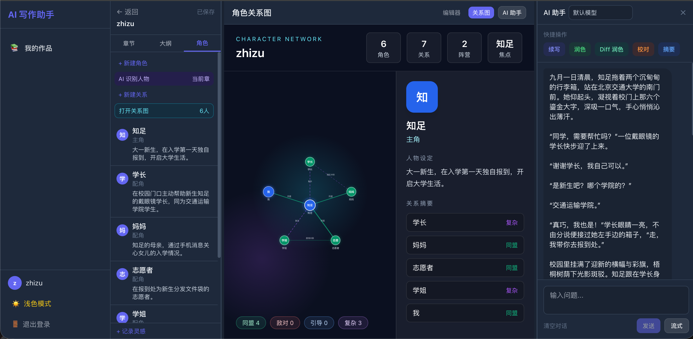
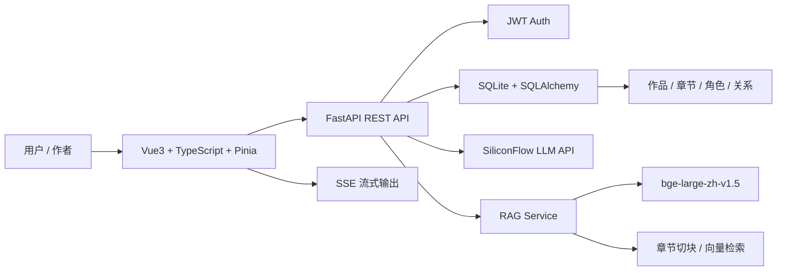

# AI Copilot 写作平台

面向长篇网文创作的 AI 全栈写作辅助系统。项目基于 **FastAPI + Vue3 + TypeScript**，集成大模型写作、RAG 检索增强、AI Diff 润色、自动人物识别和角色关系图谱，目标是把传统“AI 聊天框”升级成一个可落地的小说创作工作台。

> 项目定位：暑期 AI 全栈开发实习作品集项目，重点展示 AI 应用落地、前后端工程能力、产品交互设计和技术表达能力。

---

## 核心亮点

| 能力 | 说明 |
|------|------|
| AI 写作助手 | 支持续写、润色、校对、摘要、大纲生成和自由对话 |
| 流式输出 | 使用 SSE 实现 AI 内容逐字生成，提升交互体验 |
| RAG 检索增强 | 保存章节时自动切块索引，续写时检索全书相关上下文 |
| AI Diff 润色 | AI 生成润色文本，后端计算差异，前端展示红绿对比并支持接受修改 |
| AI 人物识别 | 从章节正文中自动抽取人物候选，用户确认后保存到角色库 |
| 角色关系图谱 | 支持人物关系管理，并用沉浸式 SVG 网络图展示阵营、冲突和关系强度 |
| Dashboard 首页 | 作品统计、写作趋势、常用工具和人物关系概览集中展示 |
| 用户认证 | JWT 登录注册、bcrypt 密码加密、用户数据隔离 |

---

## 页面预览

### Dashboard 首页



### 最近作品与人物关系概览



### 写作工作台与 AI 助手



### 角色关系图谱



---

## 使用流程

推荐按下面流程使用平台：

1. 在 Dashboard 查看作品、写作趋势和最近项目。
2. 进入作品工作台，编辑章节正文。
3. 使用 AI 助手续写、润色、校对或总结内容。
4. 在当前章节点击 `AI 识别人物`，将人物候选保存到角色库。
5. 通过 `关系图` 梳理人物网络、阵营和剧情冲突。
6. 使用 `Diff 润色` 对比 AI 修改结果，确认后写回正文。

---

## 页面与功能

### Dashboard 控制台

- 产品级首页，而不是简单作品列表
- 展示作品数、累计字数、章节数、连续创作天数
- 展示本周写作趋势
- 展示 AI 能力模块：续写、Diff 润色、人物识别、关系图谱
- 提供常用写作工具入口，方便进入编辑、润色、人物整理和关系图谱

### 写作工作台

- 左侧：章节、大纲、角色管理
- 中间：章节正文编辑器 / 角色关系图切换
- 右侧：AI 助手面板
- 支持自动保存、AI 内容插入、AI 替换撤销

### AI Diff 润色

传统 AI 润色容易直接覆盖原文，本项目采用更可控的工程方案：

1. AI 只负责生成润色后的文本
2. 后端使用 `difflib.SequenceMatcher` 计算原文和润色结果的差异
3. 前端展示删除/新增的红绿 Diff
4. 用户确认后再写回编辑器

这种设计避免大模型直接控制正文，降低误改风险。

### AI 人物识别

用户无需手动录入全部人物。系统可以从当前章节正文中抽取人物候选：

- 人物姓名
- 人物身份，例如主角、反派、师父、同伴、配角
- 一句话简介
- 识别置信度

前端先展示候选卡片，由用户勾选确认后再保存到角色库，避免误识别造成脏数据。

### 角色关系图谱

角色关系图谱用于展示长篇小说的人物网络：

- 支持真实人物关系入库
- 关系类型：同盟、敌对、引导/师徒、复杂/暧昧
- 关系强度：1-5
- 沉浸式 SVG 网络图
- 点击节点查看人物卡片
- 关系图优先使用真实关系，没有关系时自动生成展示关系作为兜底

---

## 技术架构



---

## 技术栈

### 前端

| 技术 | 说明 |
|------|------|
| Vue3 | 前端框架 |
| TypeScript | 类型安全 |
| Pinia | 状态管理 |
| Vue Router | 页面路由 |
| Tailwind CSS | UI 样式 |
| Vite | 构建工具 |
| Axios / Fetch | HTTP 与 SSE 请求 |

### 后端

| 技术 | 说明 |
|------|------|
| FastAPI | 异步 Web 框架 |
| SQLAlchemy 2.0 | ORM 数据建模 |
| SQLite | 本地轻量数据库 |
| Pydantic | 请求/响应模型校验 |
| python-jose | JWT 认证 |
| bcrypt | 密码哈希 |
| httpx | 异步调用大模型接口 |
| pytest | 单元测试 |

### AI 能力

| 能力 | 实现 |
|------|------|
| 大模型调用 | SiliconFlow Chat Completions |
| 默认模型 | DeepSeek-V3.2 |
| 多模型切换 | DeepSeek / GLM / MiniMax |
| RAG Embedding | BAAI/bge-large-zh-v1.5 |
| 流式生成 | Server-Sent Events |
| 结构化抽取 | Prompt + JSON 解析 + 用户确认 |

---

## API 概览

### 认证

| 方法 | 路径 | 说明 |
|------|------|------|
| POST | `/api/auth/register` | 用户注册 |
| POST | `/api/auth/login` | 用户登录 |
| GET | `/api/auth/me` | 当前用户 |

### 作品与写作

| 方法 | 路径 | 说明 |
|------|------|------|
| GET | `/api/books` | 获取作品列表 |
| POST | `/api/books` | 创建作品 |
| GET | `/api/books/{book_id}` | 作品详情 |
| POST | `/api/books/{book_id}/chapters` | 创建章节 |
| PUT | `/api/chapters/save` | 保存章节并触发 RAG 索引 |
| POST | `/api/books/{book_id}/characters` | 创建角色 |
| POST | `/api/books/{book_id}/character-relations` | 创建人物关系 |

### AI

| 方法 | 路径 | 说明 |
|------|------|------|
| POST | `/api/ai/chat` | AI 对话 |
| POST | `/api/ai/chat/stream` | AI 流式对话 |
| POST | `/api/ai/write` | AI 写作辅助 |
| POST | `/api/ai/write/stream` | AI 流式写作 |
| POST | `/api/ai/polish-diff` | AI Diff 润色 |
| POST | `/api/ai/extract-characters` | AI 识别章节人物 |
| POST | `/api/ai/outline` | 生成大纲 |

---

## 快速开始

### 环境要求

- Python 3.9+
- Node.js 18+
- SiliconFlow API Key

### 1. 克隆项目

```bash
git clone https://github.com/tbyang28/ai-writing-assistant.git
cd ai-writing-assistant
```

### 2. 配置环境变量

后端创建 `.env`：

```env
SECRET_KEY=your-secret-key
SILICONFLOW_API_KEY=your-api-key
DEEPSEEK_MODEL=deepseek-ai/DeepSeek-V3.2
DATABASE_URL=sqlite+aiosqlite:///./writing_platform.db
ACCESS_TOKEN_EXPIRE_MINUTES=1440
```

### 3. 启动后端

```bash
cd backend
python -m venv venv
source venv/bin/activate
pip install -r requirements.txt
uvicorn app.main:app --reload --host 0.0.0.0 --port 8000
```

### 4. 启动前端

```bash
cd frontend
npm install
npm run dev
```

### 5. 访问地址

| 服务 | 地址 |
|------|------|
| 前端 | http://localhost:5173 |
| 后端 | http://localhost:8000 |
| API 文档 | http://localhost:8000/docs |

---

## Docker 启动

```bash
cp .env.docker.example .env
docker-compose up --build
```

访问：

- 前端：http://localhost
- 后端：http://localhost:8000
- API 文档：http://localhost:8000/docs

---

## 测试

```bash
cd backend
source venv/bin/activate
pytest tests/ -v
```

已覆盖模块：

- 认证服务
- JWT 与密码哈希
- AI Prompt 构建
- AI Diff 解析
- 人物识别 JSON 解析
- RAG 文本切块与相似度
- 作品/章节/角色 API

---

## 项目结构

```text
ai-writing-assistant/
├── backend/
│   ├── app/
│   │   ├── models/          # SQLAlchemy 模型
│   │   ├── routers/         # FastAPI 路由
│   │   ├── schemas/         # Pydantic Schema
│   │   ├── services/        # AI / RAG / Auth 服务
│   │   ├── database.py
│   │   └── main.py
│   ├── tests/
│   └── requirements.txt
├── frontend/
│   ├── src/
│   │   ├── components/      # AI 面板、关系图等组件
│   │   ├── views/           # Dashboard / Editor / Auth
│   │   ├── stores/          # Pinia 状态
│   │   ├── api/
│   │   └── assets/
│   ├── package.json
│   └── vite.config.ts
├── docker-compose.yml
├── start.sh
├── stop.sh
└── README.md
```

---

## 面试讲解重点

这个项目不是简单套一个聊天接口，而是围绕“长篇小说创作”的真实工作流做 AI 产品化：

- **产品设计**：从 Dashboard 到编辑器，再到人物关系图，有完整演示路径。
- **AI 工程**：AI 续写、结构化人物抽取、Diff 润色和 RAG 检索分别解决不同写作场景。
- **可控性**：AI 结果不直接污染正文或数据库，关键步骤都让用户确认。
- **全栈能力**：FastAPI 后端、Vue3 前端、JWT 认证、数据库建模、SSE 流式输出、Docker 部署。
- **工程质量**：有单元测试、错误处理、多模型配置和可扩展的数据模型。

---

## 后续规划

- AI 自动推荐人物关系
- 角色关系变化时间线
- 全文一致性检查
- 伏笔分析和回收提醒
- TipTap 富文本编辑器
- 示例作品一键初始化
- README 实际截图补充

---

## 项目信息

- GitHub: https://github.com/tbyang28/ai-writing-assistant
- 作者: Tianbo Yang
- 用途: AI 全栈开发实习项目展示
